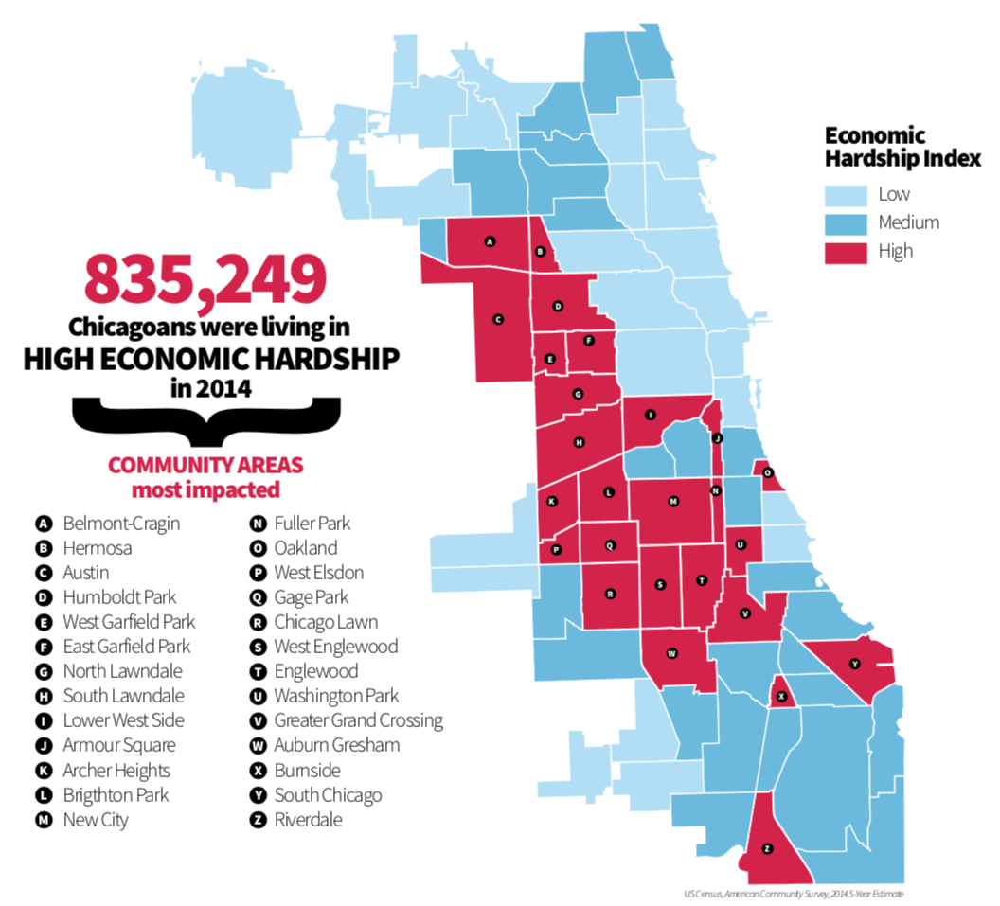
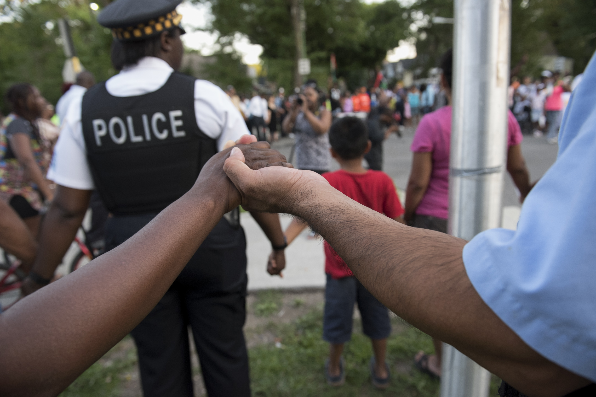

## Economic Hardship Index

The Economic Hardship Index compares social and economic conditions between Chicago communities. The hardship index is a relative composite of six indicators:


1. Crowded housing (percentage occupied by housing units with more than one person per room);

1. Poverty (percentage of persons living below the federal poverty level);

1. Unemployment (percentage of persons over the age of 16 years who are unemployed);

1. Education (percentage of persons over the age of 25 years without a high school education;

1. Dependency (percentage of the population under 18 or over 64 years of age); and

1. Income (per capita income).

The hardship index provides a more complete, multidimensional measure of community socioeconomic conditions than individual measures such as income or employment alone. A community with a high hardship index score has worse social and/or economic conditions than a community with a low or medium hardship score.

## Reducing Disparities between Chicago’s Neighborhoods

Chicago has always been a city of enormous diversity. In 2016, the city’s population was 32.3 percent white, 30.6 percent Black or African American, 29.1 percent Hispanic or Latino, 6.0 percent Asian, 1.6 percent multi-racial, and 0.4 percent American Indian, Alaska Native, Native Hawaiian, other Pacific Islander, or some other race. The city’s rich history of immigration and culture is reflected in its people, with residents from over 140 countries and more than 100 languages spoken. 

However, Chicago’s communities remain largely divided along racial and socioeconomic lines. The city consistently ranks among the top five most segregated cities in America. Opportunity is not equally accessible, and economic hardship is experienced disproportionately by Chicago’s Black and Latino residents, who largely reside in the city’s South, Southwest, West, and Northwest Sides. Black and Latino residents are more than twice as likely to be unemployed and face significant barriers accessing services. These socioeconomic conditions contribute to significant health disparities in communities and prevent many people from living healthy lives. Over the past several decades, key decision makers – including developers and banks – have failed to invest equitably in communities of color. This has created a spiraling effect of depopulation, disinvestment, and disproportionate public health impacts that persist to this day. 

In recent years, dramatic steps have been taken to promote greater access to opportunity and higher quality of life for all of Chicago’s residents. Increasingly, businesses are setting up shop on the South and West Sides, including the new Method soap factory in the Pullman neighborhood, Whole Foods in Englewood, and the NorthPoint Development Distribution Center on the Southeast Side. The City of Chicago also announced that its Fleet and Facility Management (FFM) and Chicago Park District (CPK) headquarters will move to Englewood and Brighton Park, respectively, and its upcoming Joint Public Safety Training Academy will be located in West Garfield Park. These types of strategic investments are creating thousands of jobs for residents in neighborhoods that have been historically isolated from the city’s economic fortunes. The City of Chicago is also working to ensure that every child has access to a quality education. In 2012, Chicago Public Schools (CPS) extended its school day and year, providing CPS students with nearly two and a half years of additional instruction between kindergarten and high school graduation. For residents seeking higher education, a college degree is now more accessible than ever before. With the launch of the STAR Scholarship program in 2015, any CPS student that graduates with a B average (3.0+ GPA) can attend any City College of Chicago for free. Finally, in 2018, Mayor Emanuel announced his commitment to make free, full-day universal prekindergarten available to every Chicago family, regardless of income. 

Despite the City’s commitment to promote prosperity for all Chicagoans through a variety of ongoing initiatives, analyses conducted during the development of this strategy revealed several areas of opportunity. These included improving coordination between City departments and agencies, further reducing unemployment, improving access to economic opportunity, and ensuring that the basic needs of all residents are met.

## Addressing the Root Causes of Crime and Violence

Crime and violence undermine Chicago communities by threatening the health and well-being of the city’s residents. Despite a downward trend in murders nationally, Chicago suffered from a sudden 58 percent increase in homicides in 2016, with 762 reported in total. Nonviolent crimes, including property crimes such as car theft and vandalism, occurred at even higher numbers. While these trends have improved in recent years, the risk of being crime-involved, by either committing or falling victim to a crime, still affects far too many Chicagoans. 

To avert the devastating effects of crime and violence, the City of Chicago has a responsibility to make Chicago safe for all residents. This is especially true for residents of certain South and West Side communities, where historical data show crime and violence are more likely to occur. To this end, the City has sought to improve public safety by investing in new policing initiatives, expanding violence prevention programs, and taking concrete steps to promote community trust. 

The City has invested in over 1,000 additional police officers, field training officers, sergeants, and lieutenants, implemented an extra 40 hours of training for every officer annually, and adopted innovative, data-driven approaches to policing. The creation of hyper-local intelligence centers and the use of advanced mobile phone technology, gunshot detection systems, and crime cameras all inform Chicago’s smart policing strategy, and cover over half the city today. These solutions enable the Chicago Police Department to utilize real-time data and monitoring to make better, more timely decisions. Yet policing alone is not the answer. 

Crime and violence are symptoms of deeper, often entrenched challenges that communities face – including limited economic opportunity and lack of social cohesion. Far too often, it is Chicago’s youth that experience the impacts of crime, violence, and trauma, the ramifications of which can extend for years to come. In this vein, the City has invested in summer employment opportunities such as One Summer Chicago, mentoring programs such as Becoming a Man and Working on Womanhood, and reconnection hubs for Chicago’s disconnected youth. 

The City has also taken significant steps to restore and build community trust. As of 2017, all Chicago patrol officers have been equipped with a body camera and the City has adopted a new policy where all audio, video, and documents from officer-involved shootings and excessive force cases are released within 60 days of a complaint being filed. More recently, the City has crafted a consent decree alongside the State Attorney General’s Office that will add independent oversight and yield lasting reforms of the Chicago Police Department. 

Despite these major strides, systemic changes to address the root causes of crime and violence are still needed to create long-lasting change to enhance public safety outcomes. While many actions have been taken to improve law enforcement and police-community relations, additional steps can be taken that drive at the inherent link between economic security, access to opportunity, and community safety. In this vein, Resilient Chicago envisions a safer Chicago for its residents by focusing on initiatives that improve communication between government and residents, promote affordability, and increase access to jobs and mobility.

## Ensuring the Provision of Critical Infrastructure

Chicago emerged as a leading transportation hub for people and goods due to its natural assets and central location within the United States. The city’s earliest non-indigenous explorers recognized the economic potential intrinsic to its waterways and Lake Michigan and laid roots accordingly. By the mid-19th century, nearly a dozen rail lines crisscrossed the city, carrying goods like grain, timber, and meat and spurring the rapid growth of new industries. With booming commerce and the promise of economic opportunity, individuals relocated to Chicago en masse, often by rail. By the turn of the 20th century, Chicago’s population had grown to nearly 1.7 million residents and, by 1950, had more than doubled to over 3.6 million residents.

The ability for people and goods to move freely throughout Chicago remains core to the city’s long-term success. Today, Chicago is home to several regional and national transportation systems including major railroad lines, freeways, a port, and two of the nation’s busiest airports. The city has more than 4,000 miles of streets and alleys that serve motorists, buses, trucks, cyclists, and pedestrians alike. The Chicago Transit Authority (CTA) – the second largest public transportation system in the United States – provides 1.6 million rides on a typical weekday. CTA service is complemented by the Divvy bike share program as well as Metra rail and Pace bus lines, which connect the surrounding six-county Chicago metropolitan area.

Even with these tremendous assets, many Chicagoans still remain disconnected from adequate transportation infrastructure and service. This lack of mobility isolates residents and limits access to economic, educational, and recreational opportunities, particularly for residents living on the outer edges of the city, where work commutes and other travel times can exceed an hour by transit. While more than $8 billion of historic public transit investments have been completed or announced, and 2,000 miles of alleys and roads have been repaved through Mayor Emanuel’s Building A New Chicago initiative, the City must remain committed to investing in new and existing transportation infrastructure and services that support emerging mobility options to better connect Chicagoans across the city.

Although a robust transportation network is crucial to Chicago’s resilience, the City must also protect something more elemental – its fresh water supply. Lake Michigan contains approximately five percent of Earth’s fresh water and is the source of two of the world’s largest water plants: the Jardine Water Purification Plant and the South Water Purification Plant. Over 5.5 million people in Chicago and its adjacent communities rely on these two facilities for clean water, which is distributed through a sprawling network of water mains. 

However, like many large cities, Chicago faces the daunting task of replacing its outdated water and sewer mains, of which approximately a quarter are more than a century old. Mayor Emanuel’s Building a New Chicago initiative has tripled the number of annual water main replacements to protect the system from contaminants and reduce water loss. The City conducts over 600,000 analyses of tap water every year to ensure the public’s health. To build on this progress, the City must continue to upgrade its critical water infrastructure while enhancing its water use and management practices, for example, by pursuing investments in green infrastructure to protect communities from increased flood risk and identifying new operational efficiencies.

## Promoting Engaged, Prepared, and Cohesive Communities

The greatness of any city lies in its people, and in this regard, Chicago is no exception. Chicago has demonstrated over the course of its history that its residents share a collective commitment to reinvent their city for the better. Whether by coming together to build the world’s first urban skyscraper in response to the Great Fire of 1871, reverse the flow of the Chicago River in 1900 to protect Lake Michigan, or pioneer modern grassroots organizing techniques to equip activists with the tools necessary to transform their communities, the ability of Chicagoans to bring about positive change is profound. 

Chicago must continue to strengthen the connections between residents, communities, and local government. Residents have a finger on the pulse of the city and live out the unique gifts and challenges of their communities every day. Local government supports communities best when it learns from the experiences of its constituents. As such, connected, civically engaged residents have the power to shape the programs and policies that affect their communities by proactively identifying and addressing areas of need. Chicago is more resilient when residents meet with local officials, vote in elections, join neighborhood groups, and perform community service activities. A culture of engagement and action creates a more equitable and connected city. 

The City of Chicago has taken concrete steps to promote an engaged constituency. The Mayor’s Office, City of Chicago departments and agencies, and local aldermen host community meetings to hear from residents directly and communicate information through mailers, newsletters, and social media. City Council meetings are open to public comment and platforms such as 311 and CHIdeas have been developed to make it easier for the City to garner input and respond to residents. Residents can sign up for the Office of Emergency Management and Communication’s Notify Chicago service, which provides text messages and e-mail alerts regarding both emergency and non-emergency situations developing in the city, or for Smart911, which enables residents or visitors to have their information immediately available to 911. 

The City recognizes that there is ample opportunity to bolster community resilience in Chicago. To support this, the City should refine existing engagement practices, enhance systems that facilitate public discourse, and identify opportunities for improved service delivery and emergency response. Ultimately, the strength of a community depends on the connectedness of all actors; efforts to bring together residents, faith- and community-based organizations, industry, labor, government, and other groups must be pursued to cultivate civic innovation. With this in mind, this strategy focuses on developing actions that contribute to a culture of engagement, cohesion, and preparedness in the face of unexpected shocks and persistent stresses.
