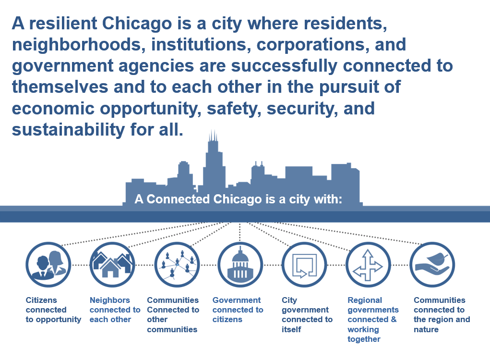

A _Resilient Chicago_ is a city where residents, neighborhoods, institutions, corporations, and government agencies are successfully connected to each other in the pursuit of economic opportunity, safety, equity, and sustainability.

## A more Connected Chicago is a city with

* Residents connected to opportunity
* Neighbors connected to each other
* Communities connected to other communities
* Governments connected to residents
* City government connected & collaborating
* Regional governments connected & working together
* Healthy communities connected to nature

