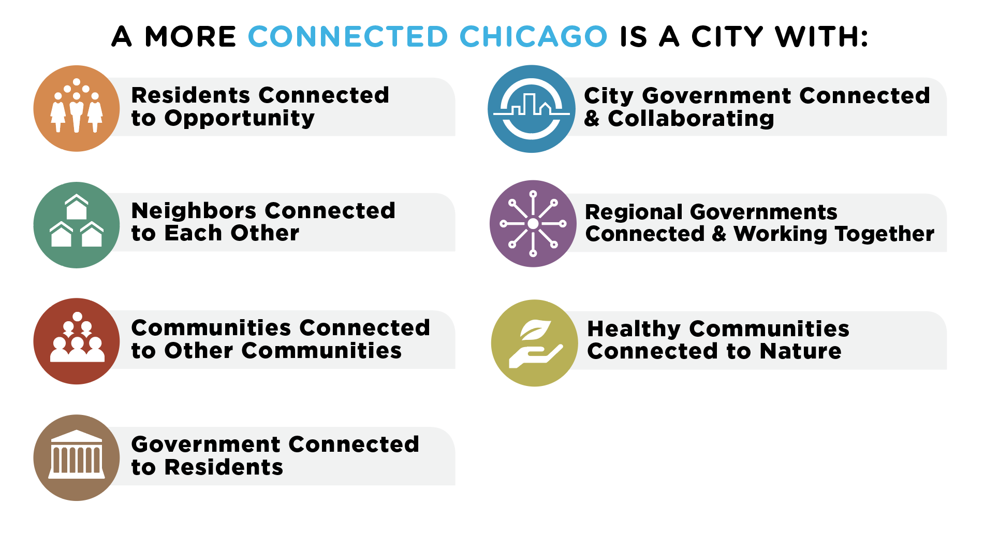

A resilient Chicago is a city where residents, neighborhoods, institutions, corporations, and government agencies are successfully connect to themselves and to each other in the pursuit of economic opportunity, safety, security, and sustainability for all.

## [FPO IMAGE OF CR STRATEGY NEEDED]
